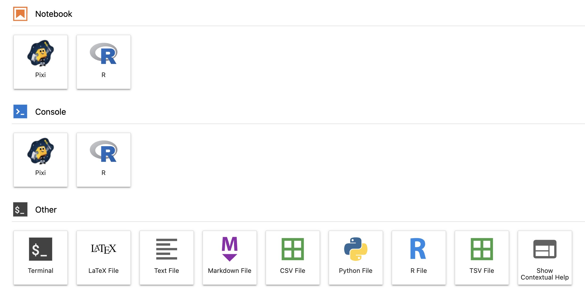

# Pixi Kernel

[![Pixi Badge][pixi-badge]](https://pixi.sh)

[![GitHub Actions][github-actions-badge]](https://github.com/renan-r-santos/pixi-kernel/actions)
[![Ruff][ruff-badge]](https://github.com/astral-sh/ruff)

[pixi-badge]: https://img.shields.io/endpoint?url=https://raw.githubusercontent.com/prefix-dev/pixi/main/assets/badge/v0.json&style=flat-square
[github-actions-badge]: https://github.com/renan-r-santos/pixi-kernel/actions/workflows/ci.yml/badge.svg
[ruff-badge]: https://img.shields.io/endpoint?url=https://raw.githubusercontent.com/astral-sh/ruff/main/assets/badge/v2.json

Use per-directory Pixi environments to run Jupyter kernels. The idea behind this project is to
capture the exact state of your environment while allowing you to make use of the rich PyPI and
Conda ecosystems.

Pixi Kernel supports Python 3.8+ and Pixi 0.18+ using `pyproject.toml` and `pixi.toml`
configurations.

**Disclaimer**: _This project is not affiliated with Pixi, and not an official Pixi plugin._

## Quick Start

1. Install this package in your JupyterLab environment alongside Pixi and restart it. You can
   install it using `pip`, `pixi` or any other conda or pip-based package manager.
2. Create a new directory and notebook and select the **Pixi** kernel for the notebook.
3. Initialize a Pixi project with `pixi init` and `pixi add ipykernel`.
4. Restart the kernel and you are good to go.

See the [Pixi docs](https://pixi.sh/latest/) for more information on how to use Pixi.

## User Experience

If the Pixi Kernel is used in a project where `pixi` is not installed or the project does not have
`ipykernel` installed in the environment, starting the kernel fails.

A fallback kernel is then started showing a helpful message when you try to run the notebook. This
is a regular IPython kernel which allows you to run shell commands and hopefully fix the
configuration of the project.

## Limitations

Pixi Kernel does not support using Pixi environments other than the default one. If you have an
idea how to support this, please open an issue or check the [contributing guide](CONTRIBUTING.md)
to open a pull request.

## Related

- [Pyproject Local Jupyter Kernel](https://github.com/bluss/pyproject-local-kernel)
- [Poetry-kernel](https://github.com/pathbird/poetry-kernel)
- [Python Local .venv Kernel](https://github.com/goerz/python-localvenv-kernel)
